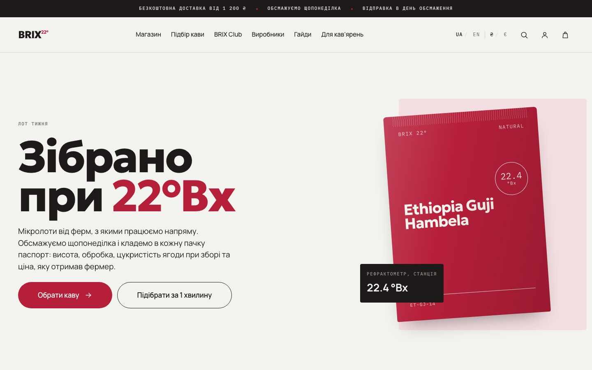
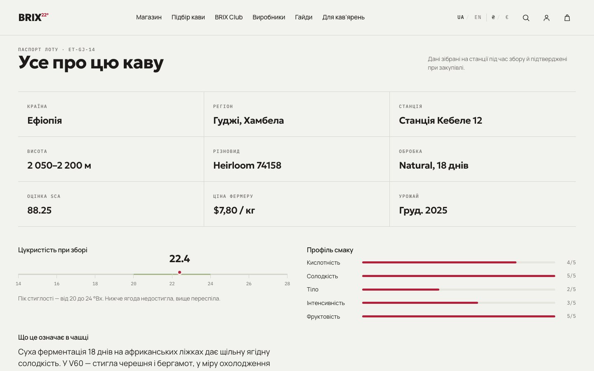
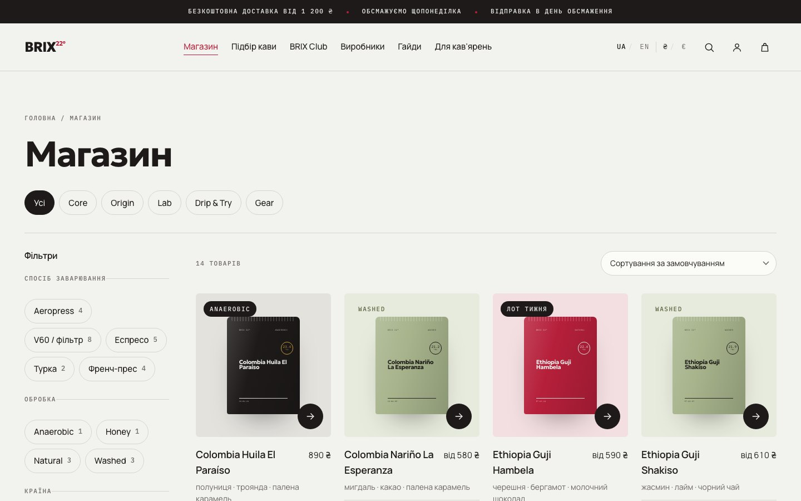
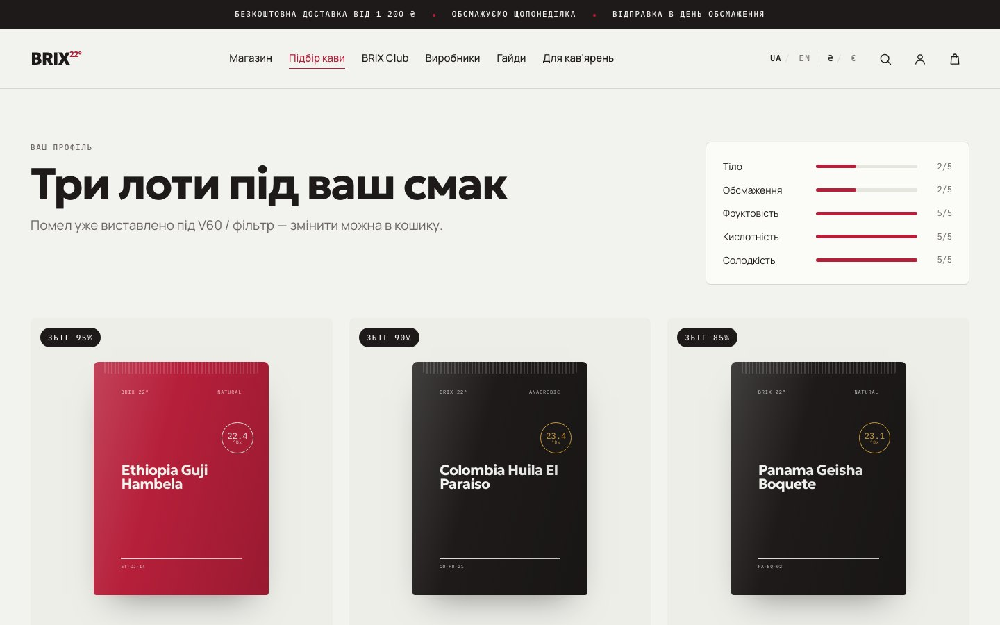
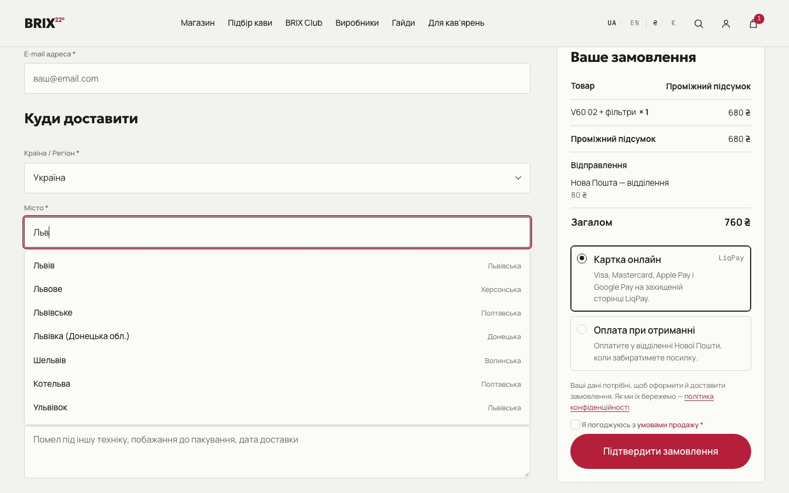
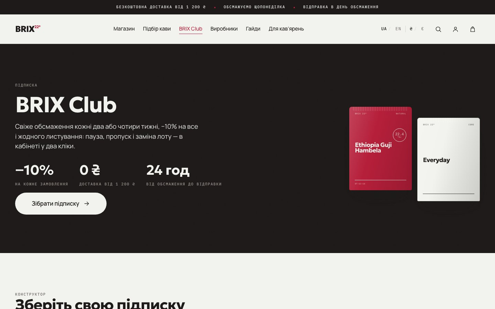
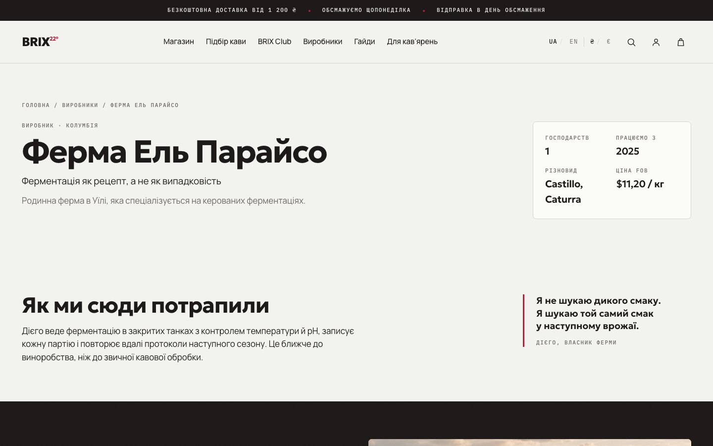
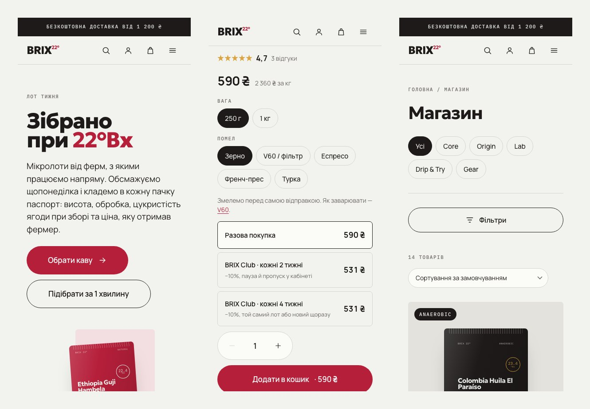

# BRIX 22° — a specialty coffee store on WordPress and WooCommerce

A concept coffee roastery shop with a custom theme, a domain plugin and no page
builder. Every lot carries a **passport** — altitude, variety, processing, the
sugar content of the cherry at harvest (°Bx) and the price the farmer was paid.
Ukrainian and English, hryvnia and euro, card payments through LiqPay, delivery
through Nova Poshta, subscriptions, a taste quiz and a B2B channel.

[](https://github.com/zapolskyi/brix/actions/workflows/ci.yml)

**Live demo:** [brix.zapolskyi.com](https://brix.zapolskyi.com)

> Pet project. The roastery, farms, prices, reviews and contact details are
> invented, payments run in the LiqPay sandbox (no money moves) and the site is
> closed to search engines. This is a study piece, not a real business.



---

## Why it exists

My previous two projects were a service site and a landing page. This time I
wanted a real shop: a catalogue with variations, a checkout that has to work in
Ukraine, money, e-mail, subscriptions and the legal minimum for a site that
collects personal data.

The constraint I set for myself: **the whole store works with JavaScript
disabled.** Filters are links, the quiz is a form, the cart is a plain submit,
and an order can be placed end to end without a single script. JavaScript only
makes the same things faster.

That rule forced an architecture: **every piece of markup exists exactly once,
in PHP.** When the catalogue filters over AJAX, the browser does not build the
grid — it asks the server for the same template partial the page itself renders
and swaps it in. There is no second implementation to drift out of sync. The
same pattern repeats for the product page, the quiz and the Gutenberg blocks,
whose editor preview is rendered by the same PHP as the front end.

## What's inside

**A lot passport instead of a product description.** 25 fields per lot,
registered in code through Secure Custom Fields so the schema lives in version
control. The product page draws the sugar-content scale, the taste profile and
a freshness window computed from the roast date.



**A catalogue that works without scripts.** Filters, sorting and pagination are
plain links; with JavaScript the same server-rendered fragment is swapped in
place. Search also looks through taxonomies: the lots are named in English, and
"ефіоп" has to find *Ethiopia Guji Hambela* through the country term.



**A taste quiz.** Six questions, a taste profile and three matched lots with a
match percentage. The result is a URL, so it can be shared, and the grind is
already set for the chosen brew method.



**Checkout built for Ukraine.** A city and branch autocomplete backed by a local
copy of the Nova Poshta directory — 11 210 cities and 52 350 points, loaded
once and kept in our own table, so the API key never reaches the server that
serves visitors. Two payment methods, cash on delivery and a card through
LiqPay, with cash on delivery withdrawn for euro orders and for anything abroad.
The customer is confirmed by whoever learns of the payment first: the return
page asks LiqPay itself, and LiqPay's own callback covers the customer who never
comes back.



**BRIX Club.** A subscription implemented in-house instead of the paid
WooCommerce Subscriptions: pause, skip a delivery, change the lot, cancel. A
daily sweep creates the renewal orders, and a lot that is no longer for sale
postpones the subscription instead of breaking it.



**Ukrainian and English without a second tree of posts.** Translations live
next to the original as fields, and the URL prefix `/en/` picks the language.
Currency is independent of language: a visitor can read Ukrainian and pay in
euros. Prices are converted from the hryvnia at a rate set in the admin, not
stored twice, so 90 variations never carry a second price that goes stale.

**Transactional mail through the Brevo API.** One module intercepts `wp_mail()`,
so WooCommerce, WordPress and the store's own e-mails go out through the same
path, in the language the order was placed in. The key is a constant in
`wp-config.php`, not a database option that would end up in every backup. If
Brevo does not answer, the e-mail falls back to the host's mail and the failure
is logged.

**A newsletter with double opt-in.** The subscriber list lives in the site, not
in a third-party service: a token confirmation, a one-click unsubscribe, a
honeypot, an IP rate limit and a CSV export.

**A B2B channel.** An application form, moderation, then a wholesale role with
−25% pricing and a 5 kg minimum. The wholesale price is computed, not stored.

**Producers and transparency.** Farm pages with what the farmer was paid, and a
"Transparency" page with the purchase price per lot.



**Six dynamic Gutenberg blocks** — hero, lot grid, farm teaser, brew guide,
feature section and a marquee. The home page is assembled from them rather than
hard-coded, and each renders through a PHP template.



## Performance

Lighthouse, mobile preset, measured on the live domain:

| Page | Performance | Accessibility | Best Practices | LCP | CLS | Weight |
|---|---|---|---|---|---|---|
| Home | 96 | 100 | 100 | 2.2 s | 0 | 193 KiB |
| Lot page | 98 | 100 | 100 | 1.9 s | 0 | 202 KiB |
| Catalogue | 97 | 100 | 100 | 2.1 s | 0 | 207 KiB |

SEO is 66–69 for one reason only: *Page is blocked from indexing*, on purpose.
Every other audit in the category passes.

What got it there: self-hosted variable fonts (eight subset files, 128 KB in
total), critical CSS built as its own Sass entry point and inlined into
`<head>`, no jQuery in the theme, no bundler, and scripts that load only on the
pages that use them. Accessibility is checked with axe-core against WCAG 2.2 AA; the key
pages have no violations.

## Privacy and security

A shop collects names, phones and addresses, so this was treated as a feature,
not an afterthought:

- **Only the cookies the site cannot work without** — cart, login and the chosen
  currency. WooCommerce's order attribution, which sets marketing cookies on every
  visitor, is switched off.
- **Analytics asks first.** Google Analytics loads only after an explicit
  "Allow", the consent form works without JavaScript, "Decline" has the same
  weight as "Allow", withdrawing is one link in the footer, and declining
  removes the `_ga*` cookies. Until a GA4 ID is set, the site asks nothing.
- **Terms of sale and a checkbox** at checkout, a rewritten privacy policy that
  names every processor (Nova Poshta, LiqPay, Brevo, the host), lists every
  cookie and gives retention periods.
- **Hardening in code:** `nosniff`, `X-Frame-Options`, `Referrer-Policy`,
  `Permissions-Policy` and HSTS over HTTPS; `xmlrpc.php` answers 403; the admin
  login is not exposed through `?author=1`, the REST user list or oEmbed; the
  file editor is disabled.
- **Secrets stay out of the repository.** LiqPay keys live in options, the
  Brevo and Nova Poshta keys are constants in `wp-config.php`, and the payment
  callback verifies LiqPay's signature. The full history was scanned before the
  first push.

## Tools

```bash
cd themes/brix
npm run css     # readable CSS, this is what is committed
npm run build   # minified CSS + critical CSS
npm run zip     # deployable archives: dist/brix.zip and dist/brix-core.zip
npm run shot -- https://brix.zapolskyi.com/shop/ --w=390   # screenshot + overflow check
```

`npm run shot` exists because headless Chrome on macOS will not make the window
narrower than 500 px: `--window-size=390` silently returns a 500 px screenshot,
so the layout looks broken where it is fine and fine where it is broken. The
tool sets the width through the DevTools Protocol instead.

`npm run zip` packs with `git archive`, so only committed files get in, and
`.gitattributes` keeps the Sass sources, docs and dev tools out of the archive.

CI runs PHP syntax and PHPCS against the WordPress Coding Standards, builds the
Sass and fails when the committed CSS does not match its source.

## Layout

```
wp-content/
├── themes/brix/          presentation — templates, styles, REST endpoints that return markup
│   ├── inc/              modules loaded by functions.php
│   ├── template-parts/   partials shared by pages and endpoints
│   ├── woocommerce/      WooCommerce template overrides
│   ├── blocks/           six dynamic Gutenberg blocks
│   ├── assets/           SCSS, vanilla JS, eight subset woff2 files
│   └── docs/             plan, phases, 31 decision records, dev log, launch guide
└── plugins/brix-core/    domain — data, business rules, integrations
    ├── data/             demo content, translations, photos
    └── src/
        ├── Product/      lot passport, freshness window, Product schema
        ├── Club/         subscriptions: plan, renewals, customer actions
        ├── Payments/     LiqPay, monobank, cash-on-delivery rules
        ├── Shipping/     Nova Poshta directory, rates, branch pickup
        ├── Wholesale/    B2B applications, role, pricing
        ├── Quiz/         questions and the recommendation engine
        ├── I18n/         language, currency, translated e-mails
        ├── Mail/         Brevo transport
        ├── Newsletter/   double opt-in subscribers
        ├── Privacy/      cookie consent, terms of sale
        ├── Security/     hardening
        └── Cli/          wp brix setup / demo / translate / np-sync / mail-test
```

**The split is strict.** The plugin owns data and rules and never renders a
page. The theme owns markup — which is why its REST endpoints return HTML
rather than JSON: they exist to re-render what the page already renders.
Deactivating the plugin degrades the store; it does not break the theme.

## Running it locally

Requires PHP 8.2+, MySQL, WordPress 6.6+, WooCommerce, Secure Custom Fields and
Node 20+.

```bash
# 1. Put the theme and the plugin in place
cp -r themes/brix        /path/to/wp-content/themes/
cp -r plugins/brix-core  /path/to/wp-content/plugins/

# 2. Activate, then configure the store: languages, currency, pages, menus,
#    product lines, shipping zones, payment methods, legal pages
wp theme activate brix
wp plugin activate woocommerce secure-custom-fields brix-core
wp brix setup

# 3. Fill it: 14 lots, 90 variations, 4 farms, 5 guides, photos, pages
wp brix demo

# 4. The English version
wp brix translate
```

The commands are idempotent — running them twice changes nothing.

The Nova Poshta directory is loaded with `wp brix np-sync` and needs a free API
key in `wp-config.php` (`BRIX_NOVA_POSHTA_KEY`) — only to fill or refresh the
table; the checkout autocomplete reads the local copy. E-mail through Brevo needs `BRIX_BREVO_KEY` and
`BRIX_BREVO_SENDER`; without them WordPress uses its own mail. The launch guide
is [`05-zapusk.md`](themes/brix/docs/05-zapusk.md).

## The bug worth remembering

The first deployment rehearsal — a clean WordPress in a separate database,
built only from the two archives and the three `wp brix` commands — found **eight
differences** between the site on my machine and the site a stranger would get:

- a fresh WooCommerce creates a *block* checkout, which renders nothing without
  JavaScript and has no place for the Nova Poshta fields;
- WordPress silently refuses `WPLANG=uk` until the Ukrainian language pack is
  installed, so the site stayed English and the theme used English strings on
  the Ukrainian pages;
- WooCommerce translations come as a separate language pack that my local site
  had installed long before — the clean one said "Your cart is currently
  empty!";
- the privacy policy was a draft, so the link under the *Place order* button was
  a 404;
- the English checkout showed the consent text in Ukrainian, and several pages I
  had "finished" came out empty because their text only existed in the local
  database.

Everything that lived only in the database was moved into code and demo data. The
rehearsal is now the step before every release: build, install, diff the pages
against the local site — zero differences before it ships.

## Engineering notes

The decisions that are not obvious from the code are written down, each with the
alternatives that were rejected and why:
[`themes/brix/docs/DECISIONS.md`](themes/brix/docs/DECISIONS.md). A few that
shaped the result:

- **Classic cart and checkout, not blocks.** The block checkout renders nothing
  without JavaScript, which contradicts the core constraint.
- **Dynamic blocks instead of ACF Blocks.** The front end must not depend on a
  plugin for its home page.
- **Subscriptions built in-house.** WooCommerce Subscriptions is paid, and the
  store needs exactly four actions.
- **Currency independent of language.** A Ukrainian reader may pay in euros and
  an English one in hryvnias; the price is converted, never stored twice.
- **Mail through an API, not an SMTP plugin.** One more plugin with its own
  admin screen would keep the key in the database, and so in every backup.
- **Consent form checks `Origin` instead of a nonce.** The page with the
  question comes from a page cache, and a nonce in it would expire within a
  day, leaving "Allow" a button that does nothing.

The development log, including the bugs worth remembering, is
[`PROGRESS.md`](themes/brix/docs/PROGRESS.md).

## Stack

WordPress 7 · WooCommerce 11 (HPOS) · PHP 8.2 · Secure Custom Fields · SCSS
(BEM, no framework) · vanilla JavaScript (no jQuery) · LiqPay · Nova Poshta API
· Brevo · WP-CLI · PHPCS with WordPress Coding Standards · GitHub Actions ·
Hostinger + LiteSpeed

Roughly 24 000 lines of PHP, 5 000 of SCSS and 1 600 of JavaScript.

## Licence

MIT — see [LICENSE](LICENSE). The brand, copy and photographs are part of the
portfolio piece; the code is free to reuse.
